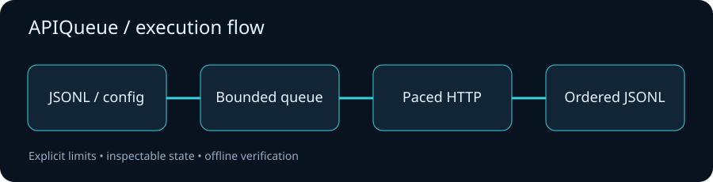

# APIQueue

**Run HTTP batches with controlled concurrency, request pacing and finite retries.**


APIQueue is an async Python CLI and library built on HTTPX. It takes JSONL jobs,
feeds a bounded worker queue and returns ordered JSONL results. Each result
includes status, attempts, duration, bounded response text and a stable error.
The included demo and test suite run completely offline.



## Quick start

```bash
python -m venv .venv
. .venv/bin/activate
python -m pip install --upgrade pip
python -m pip install -e '.[dev]'
python examples/offline_demo.py
apiqueue examples/jobs.jsonl --config examples/queue.toml --verbose
```

The CLI example contacts public example URLs. For reproducible verification, use
the offline demo. Jobs have this shape:

```json
{"id":"health","url":"https://example.com","method":"GET"}
```

A `POST` job can include `json_body`. Retrying a write requires `retry_safe: true`;
set it only when your server guarantees idempotency. JSON attempt logs go to
stderr, results to stdout. Exit codes: `0` all requests succeeded, `1` at least
one request failed, `2` invalid jobs/configuration or a batch execution failure.

## Behaviors that matter

- A shared limiter spaces every attempt, including retries, across all workers.
- `429`, `500`, `502`, `503`, `504` and transport errors can retry, with finite
  attempts and exponential backoff. Other responses are terminal.
- Valid `Retry-After` seconds and dates take precedence. Delays above the
  configured ceiling stop with `retry_delay_limit` rather than retrying early.
- GET, HEAD and OPTIONS are retryable by default; other methods require opt-in.
- Response size, job count, pending queue size and connection count are bounded.
- Structured attempt logs omit URLs, request payloads and response bodies.
- Redirects are returned as results. TaskGroup propagates cancellation to workers.

## Library

```python
import httpx
from apiqueue.core import APIQueue, Job, QueueConfig


async def fetch():
    async with httpx.AsyncClient() as client:
        return await APIQueue(client, QueueConfig(concurrency=2)).run(
            [Job("docs", "https://example.com")]
        )
```

## Verification and limits

```bash
pytest -q
ruff check .
ruff format --check .
```

Tests use HTTPX MockTransport and cover retries, pacing, cancellation, ordering,
concurrency, unsafe method retries, limits and invalid inputs. See
[operational notes](docs/architecture.md).

The queue is in memory and results remain in memory up to `max_jobs`. There is
no persistent job ledger or crash recovery. CLI requests use no environment
proxy and require no API subscription. Remote servers may require credentials;
authenticated applications should create their own HTTPX client through the
library. Use synthetic job ids because ids are present in logs. Responses may
contain private content and the CLI prints them to stdout.

## Roadmap

- Incremental ordered result sinks for larger batches.
- Optional persistent job ledger and resume semantics.
- Per-origin pacing and explicit credential providers.

[Local verification](docs/VERIFICATION.md) · [API reference](docs/API.md) · [Contributing](CONTRIBUTING.md) · [Changelog](CHANGELOG.md) · [MIT license](LICENSE)
